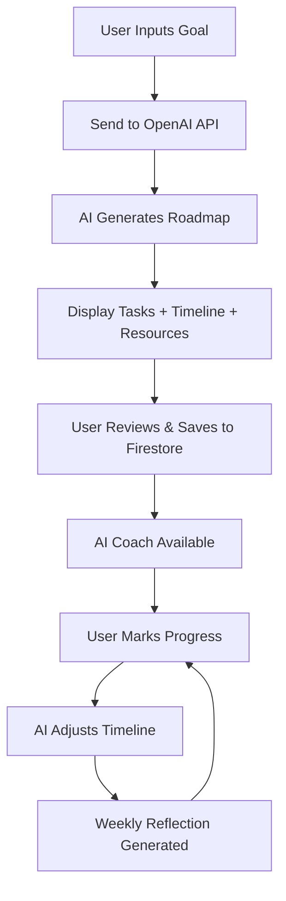

# TaskFlow AI 🎯

**Intelligent Goal Planner & Execution Assistant**

Transform your ambitions into actionable roadmaps with AI-powered planning, smart tracking, and personalized productivity coaching.

[](https://opensource.org/licenses/MIT)
[](https://nextjs.org/)
[](https://openai.com/)
[](https://firebase.google.com/)

---

## 🌟 Overview

TaskFlow AI goes beyond traditional to-do lists by using GPT-5 to intelligently break down your goals into structured, actionable plans. Whether you're launching a startup, preparing for exams, or planning your fitness journey, TaskFlow AI acts as your personal productivity partner.

### The Problem We Solve

- 🤔 **Goal Paralysis**: Users struggle to break large goals into manageable steps
- 📋 **Static Planning**: Existing tools don't adapt when life gets in the way
- 🎯 **Context Loss**: No guidance on *how* to accomplish each task
- 📊 **Progress Blindness**: Difficulty tracking meaningful progress over time

### Our Solution

TaskFlow AI combines **AI planning**, **adaptive tracking**, and **personalized coaching** into one intelligent workspace that grows with you.

---

## ✨ Key Features

### 🤖 AI-Powered Goal Breakdown
Convert any goal into a structured roadmap with subtasks, milestones, and realistic timelines.

### 📚 Smart Resource Recommender
Get relevant guides, tutorials, and resources for each task automatically.

### 💬 AI Productivity Coach
Ask questions like "How do I complete this step?" and receive tailored, contextual advice.

### 📈 Progress Tracker & Insights
Dynamic timeline adjustments based on your actual progress, with intelligent forecasting.

### 🎯 Motivation System
Personalized reminders, motivational messages, and productivity insights to keep you on track.

### 📋 Goal Template Library
Pre-built templates for common goals:
- 💼 Startup Launch
- 📚 Exam Preparation
- 💪 Fitness Journey
- 🕌 Umrah Preparation
- 🎨 Creative Projects
- And more...

### 👥 Team Collaboration *(Optional)*
Share goals and assign tasks collaboratively with team members.

### 📝 Reflection Journal
Weekly AI-generated summaries analyzing what worked, what didn't, and how to improve.

---

## 🏗️ Tech Stack

### Frontend
- **Framework**: Next.js 14+ (App Router)
- **Styling**: TailwindCSS
- **UI Components**: shadcn/ui
- **State Management**: React Context / Zustand

### Backend
- **Runtime**: Node.js
- **Functions**: Firebase Cloud Functions
- **API Framework**: Express.js

### Database & Auth
- **Database**: Firestore (NoSQL)
- **Authentication**: Firebase Auth
- **Storage**: Firebase Storage (for attachments)

### AI/ML
- **Primary Model**: OpenAI GPT-5 (Chat Completions)
- **Embeddings**: OpenAI Embeddings API
- **Sentiment Analysis**: Optional sentiment tracking

### Deployment
- **Frontend Hosting**: Vercel
- **Backend**: Firebase
- **CI/CD**: GitHub Actions

---

## 🗂️ System Architecture

### Entity Relationship Diagram

```
User (1) ────< Goal (M)
              │
              └──< Task (M)
                   │
                   └──< ProgressLog (M)
```

**Relationships:**
- One User can have multiple Goals
- Each Goal contains multiple Tasks
- Each Task has associated ProgressLogs for tracking updates

### Core Workflow



---

## 🚀 Getting Started

### Prerequisites

- Node.js 18+ and npm/yarn
- Firebase account and project
- OpenAI API key

### Installation

1. **Clone the repository**
```bash
git clone https://github.com/yourusername/taskflow-ai.git
cd taskflow-ai
```

2. **Install dependencies**
```bash
npm install
# or
yarn install
```

3. **Set up environment variables**

Create a `.env.local` file in the root directory:

```env
# OpenAI Configuration
OPENAI_API_KEY=your_openai_api_key_here

# Firebase Configuration
NEXT_PUBLIC_FIREBASE_API_KEY=your_firebase_api_key
NEXT_PUBLIC_FIREBASE_AUTH_DOMAIN=your_project.firebaseapp.com
NEXT_PUBLIC_FIREBASE_PROJECT_ID=your_project_id
NEXT_PUBLIC_FIREBASE_STORAGE_BUCKET=your_project.appspot.com
NEXT_PUBLIC_FIREBASE_MESSAGING_SENDER_ID=your_sender_id
NEXT_PUBLIC_FIREBASE_APP_ID=your_app_id

# Firebase Admin (for backend)
FIREBASE_ADMIN_PROJECT_ID=your_project_id
FIREBASE_ADMIN_PRIVATE_KEY=your_private_key
FIREBASE_ADMIN_CLIENT_EMAIL=your_client_email

# Application
NEXT_PUBLIC_APP_URL=http://localhost:3000
```

4. **Initialize Firebase**
```bash
firebase init
```

Select:
- Firestore
- Functions
- Hosting

5. **Run the development server**
```bash
npm run dev
# or
yarn dev
```

Open [http://localhost:3000](http://localhost:3000) in your browser.

---

## 📁 Project Structure

```
taskflow-ai/
├── app/                    # Next.js app directory
│   ├── (auth)/            # Authentication pages
│   ├── (dashboard)/       # Main dashboard
│   ├── api/               # API routes
│   └── layout.tsx         # Root layout
├── components/            # React components
│   ├── ui/               # Reusable UI components
│   ├── goals/            # Goal-related components
│   ├── tasks/            # Task components
│   └── chat/             # AI coach chat interface
├── lib/                   # Utilities and helpers
│   ├── firebase/         # Firebase configuration
│   ├── openai/           # OpenAI integration
│   └── utils/            # Helper functions
├── hooks/                 # Custom React hooks
├── types/                 # TypeScript type definitions
├── public/               # Static assets
├── functions/            # Firebase Cloud Functions
└── firestore.rules       # Firestore security rules
```

---

## 🔧 Configuration

### Firebase Setup

1. Create a new Firebase project at [console.firebase.google.com](https://console.firebase.google.com)
2. Enable Firestore Database
3. Enable Authentication (Email/Password, Google, etc.)
4. Generate a new service account key for admin SDK
5. Add your domain to authorized domains in Firebase Authentication

### OpenAI Setup

1. Create an account at [platform.openai.com](https://platform.openai.com)
2. Generate an API key
3. Add billing information
4. Enable GPT-5 access (or use GPT-4 as fallback)

### Firestore Security Rules

Basic security rules are included. Review and customize based on your needs:

```javascript
rules_version = '2';
service cloud.firestore {
  match /databases/{database}/documents {
    match /users/{userId} {
      allow read, write: if request.auth != null && request.auth.uid == userId;
      
      match /goals/{goalId} {
        allow read, write: if request.auth != null && request.auth.uid == userId;
        
        match /tasks/{taskId} {
          allow read, write: if request.auth != null && request.auth.uid == userId;
        }
      }
    }
  }
}
```

---

## 🧪 Testing

```bash
# Run unit tests
npm run test

# Run integration tests
npm run test:integration

# Run e2e tests
npm run test:e2e
```

---

## 📦 Deployment

### Deploy to Vercel (Frontend)

```bash
# Install Vercel CLI
npm i -g vercel

# Deploy
vercel --prod
```

### Deploy Firebase Functions (Backend)

```bash
firebase deploy --only functions
```

### Deploy Firestore Rules

```bash
firebase deploy --only firestore:rules
```

---

## 🤝 Contributing

We welcome contributions! Please see our [Contributing Guide](CONTRIBUTING.md) for details.

1. Fork the repository
2. Create your feature branch (`git checkout -b feature/AmazingFeature`)
3. Commit your changes (`git commit -m 'Add some AmazingFeature'`)
4. Push to the branch (`git push origin feature/AmazingFeature`)
5. Open a Pull Request

---

## 📝 License

This project is licensed under the MIT License - see the [LICENSE](LICENSE) file for details.

---

## 🙏 Acknowledgments

- OpenAI for providing the GPT-5 API
- Firebase team for the excellent backend infrastructure
- Vercel for seamless deployment
- The open-source community for inspiration

---

## 📧 Contact

**Project Maintainer**: Your Name

- Email: your.email@example.com
- Twitter: [@yourhandle](https://twitter.com/yourhandle)
- LinkedIn: [Your Profile](https://linkedin.com/in/yourprofile)

**Project Link**: [https://github.com/yourusername/taskflow-ai](https://github.com/yourusername/taskflow-ai)

**Built with ❤️ using AI and modern web technologies**